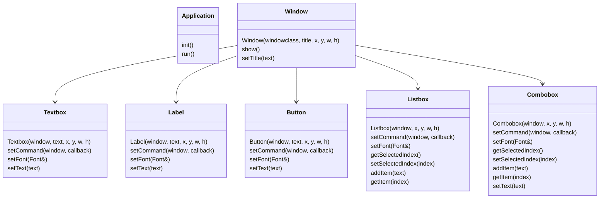

# WinGui Library
 
 A lightweight C++ wrapper over windows API calls to create UIs.
 Gives an object-oriented api on creating windows and controls
 
## To add it to your project
Right-click on your solution from solution explorer and from the `Add` context menu choose `existing project...`
Add the WinGui project to your solution. The project is a static library.

Go to your project, the one that you want to create the window in, from the solution explorer.
Select the project expand it, and right-click the `References` item
choose `Add Reference...`. Tick WinGui from the dialog.

Right-click on your project and click `Properties`. Go to the `VC++ Directories`
Set `include directories` to point to the folder that contains WinGui

## Usage example - Creating a Window:
Create a window with two buttons, a label, a textbox, a listbox and a combobox.
 ```cpp
#include <WinGui\Application.h>
#include <WinGui\Window.h>
#include <WinGui\Button.h>
#include <WinGui\Listbox.h>
#include <WinGui\Textbox.h>
#include <WinGui\Combobox.h>
#include <WinGui\Label.h>

int main(){
    WindowClass wc(L"mywin");
    Window dlgDemo(wc, L"Demo window", 250, 240);

    Button btnGetListItem( dlgDemo, "Get listbox Item", 10, 10, 100, 30);
    Button btnGetComboItem(dlgDemo, "Get combo Item",  120, 10, 100, 30);
    Label label(dlgDemo, "Color:", 10, 58, 100, 30);
    Textbox txtName(dlgDemo, "", 140, 50, 80, 25);
    Listbox lbShape(dlgDemo, 10, 90, 210, 100);
    Combobox cbColor(dlgDemo, 60, 50, 70, 130);

    lbShape.addItem("Circle");
    lbShape.addItem("Square");

    cbColor.addItem("Red");
    cbColor.addItem("Green");
      
    dlgDemo.setOnDestroyAction([]() { PostQuitMessage(0); });
    dlgDemo.show();
    Application::run();
	
	return 0;
}
```

## Result 

<p align="center">
</img>
</p>

## Usage example - Event Handlers:
Add event handlers for button, listbox and combobox

```cpp
    btnGetListItem.setCommand(dlgDemo,
        [&](int e) {
            if (e == BN_CLICKED) {
                size_t selIndex = lbShape.getSelectedIndex();
                if (selIndex != -1) {
                    auto selectedItemText = lbShape.getItem(selIndex);
                    MessageBoxA(dlgDemo.hwnd, selectedItemText.c_str(), "Information", MB_OK);
                }
            }
        }
    );
    
    lbShape.setCommand(dlgDemo,
        [&](int e) {
            if (e == LBN_SELCHANGE) {
                std::cout << "Listbox selection changed" << std::endl;
            }
        }
    );
```

## UML


