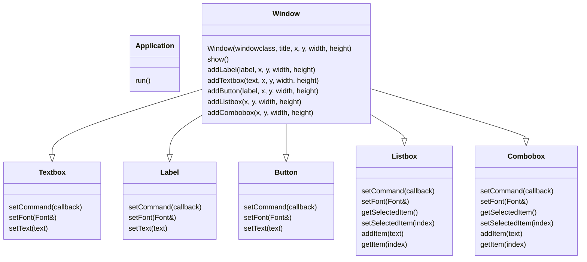

 # WinGui Library
 
 A lightweight C++ wrapper over windows API calls to create UIs.
 Gives an object-oriented api on creating windows and controls
 
## Usage example:
Create a window with two buttons, a label, a textbox, a listbox and a combobox.
 ```cpp
int main(){
    Font segoe(L"Segoe UI");
    WindowClass wc(L"mywin");
    Window dlgDemo(wc, L"Demo window", 250, 240);

    auto btnGetListItem  = window.addButton("Get listbox Item", 10, 10, 100, 30);
    auto btnGetComboItem = window.addButton("Get combo Item", 120, 10, 100, 30);
    auto label           = window.addLabel("Color:", 10, 58, 100, 30);
    auto txtName         = window.addTextbox("", 140, 50, 80, 25);
    auto lbShape         = window.addListbox(10, 90, 210, 100);
    auto cbColor         = window.addCombobox(60, 50, 70, 130);
    
    lbShape->addItem("Circle");
    lbShape->addItem("Square");

    cbColor->addItem("Red");
    cbColor->addItem("Green");
      
    dlgDemo.setOnDestroyAction([]() { PostQuitMessage(0); });
    dlgDemo.show()
    Application::run()
 }
```
Add event handlers for button, listbox and combobox

```cpp
    btnGetListItem->setCommand(
        [&](int e) {
            if (e == BN_CLICKED) {
                size_t selIndex = lbShape->getSelectedItem();
                if (selIndex != -1) {
                    auto selectedItemText = lbShape->getItem(selIndex);
                    MessageBoxA(window.hwnd, selectedItemText.c_str(), "Information", MB_OK);
                }
            }
        }
    );
    
    lbShape->setCommand(
        [&window](int e) {
            if (e == LBN_SELCHANGE) {
                std::cout << "Listbox selection changed"<< std::endl;
            }
        }
    );

    cbColor->setCommand(
        [&window](int e) {
            if (e == CBN_SELCHANGE) {
                std::cout << "Combobox selection changed" << std::endl;
            }
         }
     );
```

## UML


```

